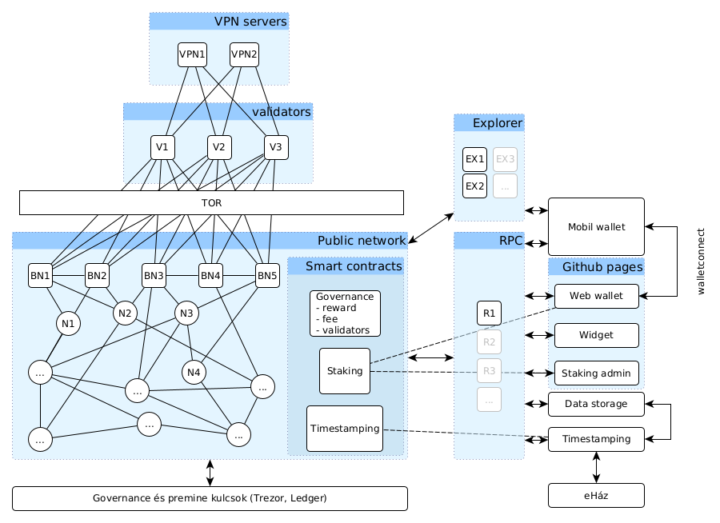

# ILGON network documentation

The ILGON network is an ethereum based network, technically very similar to the xDai chain and fully compatible with ethereum. ILGON is using Parity Openethereum V3.0.1 with the POA Authority round consensus mechanism so on the surface and on the node API level it is identical to Ethereum.

ILGON uses the same address scheme as Ethereum, and Ethereum smart contracts run on ILGON out of the box. Similarly, wallets that support adding custom ETH networks should support the network out of the box and popular hardware wallets can also be used to sign transactions on the network.

## Main parameters about ILGON

**Symbol:** ILG  
**Network ID:** 0x696c67  
**Premine amount:** 180.000.000 ILG  
**Block reward (current):** 20 ILG  
**Block time (target):** 5s  
**Block gas limit (target):** >= 20.000.000  
**Min gas price:** 1 gwei (will be increased to about USD 0.03 equivalent for 21000 gas to protect against flooding the network)  
**Technology**: Ethereum based  
**Smart contracts**: full ethereum compatibility  
**API**: same as openethereum v3.0.1  
**Consensus mechanism:** Openethereum POhA Authority round  
**Number of POA validators:** 3 (to be increased to 7 by 2021 february 10)  
**Default port:** 30303 UDP and TCP  
**Default RPC port:** 8545

## Design, components

The current network topology of the ILGON and some connected services is shown on the picture below:


Validators are the core of the system so they are hidden behind the tor network to prevent DOS attacks against them.

The Main components are:

* Validators (V1, V2, ..)
* Bootnodes (BN1, BN2, ...)
* Ordinary netwrok nodes (N1, N2, ..)
* Governance contracts (staking, fee, reward, ..)
* Supplementary contracts (Staking, Timestamping, ...)
* Governance and premine keys
* Explorer (https://ilgonexplorer.com)
* Mobile wallets (not in the store yet)
* Web wallet + widget (https://ilgonwallet.com)
* RPC API (https://rpc-mainnet.ilgonwallet.com)
* connected services (eHáz, Data storage)

We will talk about these components in detail later.

## Newtorks

ILGON has a mainnet and a public testnet available to the public.

### Mainnet information

* genesis block: https://gitlab.com/ilc-projekt/ilc-project-infrastructure/mainnet-genesis
* network id: 0x696c67
* symbol: ILG
* wallet: https://ilgonwallet.com/ (through cloudflare)
* explorer: https://www.ilgonexplorer.com/ (through cloudflare)
* RPC: https://mainnet-rpc.ilgonwallet.com/ (through cloudflare)
* validator addresses:
  * 0x236acb7b5127e88fd54c5492d570c2b33591dc4d
  * 0xb534163f6e9e4258c0ff4eaea2f480ae43ababaa
  * 0x09a87685fa46057e2f62b2e4ac5ebd78b4c3e2d9
* governance owner addresses and weights:
  * multisig contract address: 0xFF00000000000000000000000000000000000000
  * required weight: 3
  * owners:
    * 0x4B64C42F7ca2e82359811e741871516399ADEb1C (weight 3)
    * 0xb29e163105db11A4114D63FeC7961A5BFEDe2c78 (weight 1)
    * 0x36c43FcAdB7080798A2B8c4554B7773F1A01CBb3 (weight 1)
    * 0xEC8dE0feF84b9f51b4639963E8Bf07923e8Abc51 (weight 1)
    * 0x5E9903b8119A56D60EDE5E4294228a24F7F44410 (weight 1)
    * 0xdFdb9Fa20e44A02f45C7e036D40749B7488cfeD3 (weight 1)
* premine owner addresses and weights:
  * multisig contract address: 0xe5cfcb8bb377f3ad008e562fdd8f4a52706d5648
  * required weight: 2
  * owners:
    * 0x4B64C42F7ca2e82359811e741871516399ADEb1C (weight 2)
    * 0xbCa7A9428c77F9B6941Fb730b174f9ce9a1F0714 (weight 1)
    * 0x4784bdB3d84CB6D77D959B98CB51c7BDA2616753 (weight 1)
    * 0xad19E2114aD5c758fa6f2eC2c4002d4b7eab75db (weight 1)

### Testnet information

* genesis block: https://gitlab.com/ilc-projekt/ilc-project-infrastructure/testnet-genesis
* bootnodes: 163.47.11.62, 161.97.121.183, 13.251.200.141
* wallet: https://ilgonwallet.com/ (switch network)
* explorer: https://testnet.ilgonexplorer.com/
* RPC: https://testnet-rpc.ilgonwallet.com/
* network id: 0x696c6774
* premine and governance owner:	0xE5cfCB8bb377f3aD008E562FdD8F4A52706D5648
* FAUCET: 0x2d72d155a258697d366f5e2cf4fbb3186cc432fa

## Running a node

ILGON builds on the Authority round consensus mechanism of **openethereum v3.0.1**. After 3.0.1 openethereum removed some features necessary for fee governance so running an ILGON node - currently - requires you to download and run openethereum v3.0.1.

We are working on the foundation of Openethereum to make a more generic governance model possible. Our target is to achieve a dPoS modus operandi in the coming 1-2 years but vanilla openethereum node software is a good start to build trust. So - for now - you won't be required to run any custom node software.

So how is it possible to use the openethereum node software to run a different netwok? It is the genesis block, specifically the genesis JSON file that has to be properly provided.

### Genesis block/genesis JSON

In each blockchan the first block has it own, special role. This is the only block in the network that does not have a parent block and it defines a common starting point for the network nodes. All nodes participating in the ILGON network must know the genesis block, that is how they can validate the succeeding blocks and apply the governance rules.

What does the genesis block do in case of ILGON/Openethereum?

* it sets vital network parameters
* it is used to deploy some governance smart contracts required for the network to operate
* it listst the bootnodes of the network by IP
* it defines the premine

The genesis block of the main network and the testnet are provided in the below repositories:

* https://gitlab.com/ilc-projekt/ilc-project-infrastructure/mainnet-genesis
* https://gitlab.com/ilc-projekt/ilc-project-infrastructure/testnet-genesis

We have also included the 2 genesis files in this repository here:
* mainnet: [ilgGenesis.json](ilgGenesis.json)
* testnet: [ilgtGenesis.json](ilgtGenesis.json)

**NOTE** that the list of bootnodes hence the genesis.json file can change over time but other defining parameters of the genesis.json file should not be muted.

### Start a node manually

To start a network node just use openethereum **v3.0.1** as you would for ethereum and provide the appropriate genesis.json file using the --chain parameter:

For the mainnet use:
```
openethereum --chain ilgGenesis.json ......
```

For the testnet use:
```
openethereum --chain ilgtGenesis.json ......
```

### Use the pre-built docker images

There are some prebuilt fullnode docker images on dockerhub for the network:
 
https://hub.docker.com/u/ilgon

The ilgnode and ilgtnode images are normal archive nodes without open RPC ports,
the publicilgnode and publicilgtnode builds also expose the necessary RPC port for node communication but only allows the secure RPC commands to be executed.

The monitorclient is just a node image to monitor the healthyness of a node by monitoring the last block timestamp.

## Smart contracts

Ethereum smart contracts run on ILGON out of the box. You can use your usual tools. There is no need to change anything, just compile, deploy and enjoy! :)

## Developer tools

The full ethereum dev ecosystem can be used to interact with and develop for the ilgon network, you just have to use the correct network id and RPC endpoint.
The main tools that we suggest you to use:

* Remix IDE
* Truffle
* Ganache
* Metamask

## Deep technical details

As mentioned the project has the following components:

* Validators (V1, V2, ..)
* Bootnodes (BN1, BN2, ...)
* Ordinary netwrok nodes (N1, N2, ..)
* Governance contracts (staking, fee, reward, ..)
* Supplementary contracts (Staking, Timestamping, ...)
* Governance and premine keys
* Explorer (https://ilgonexplorer.com)
* Mobile wallets (not in the store yet)
* Web wallet + widget (https://ilgonwallet.com)
* RPC API (https://rpc-mainnet.ilgonwallet.com)h
* connected services (eHáz, Data storage)

Let's discuss these in a bit more detail.

